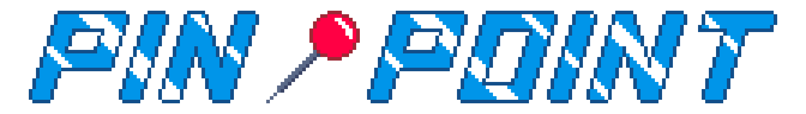

# 
Yet Another Daily Game

## License
This software is licensed under the [Anti-Capitalist Software License (v 1.4)](https://anticapitalist.software/).

## Assets Licensing
All assets (located in the assets subdirectory) were created by the author [@kfc35](https://github.com/kfc35). All assets are [CC BY-NC-SA 4.0](https://creativecommons.org/licenses/by-nc-sa/4.0/).

## Credits

### Wavelength Creators
This game is heavily inspired by / attributes its main idea to Wavelength, the party game designed by Alex Hague, Justin Vickers, and Wolfgang Warsch. Thanks for making a wonderful game that has brought me and my friends lots of joy over the years. Go buy their game and maybe check out [CMYK games](https://www.cmyk.games/), the company behind Wavelength, while you're at it!

### Game Engine
This app is powered by Bevy Engine, which is free and open-source forever! It is dual licensed under MIT or Apache-2.0. Thank you to all the contributors on the project.
